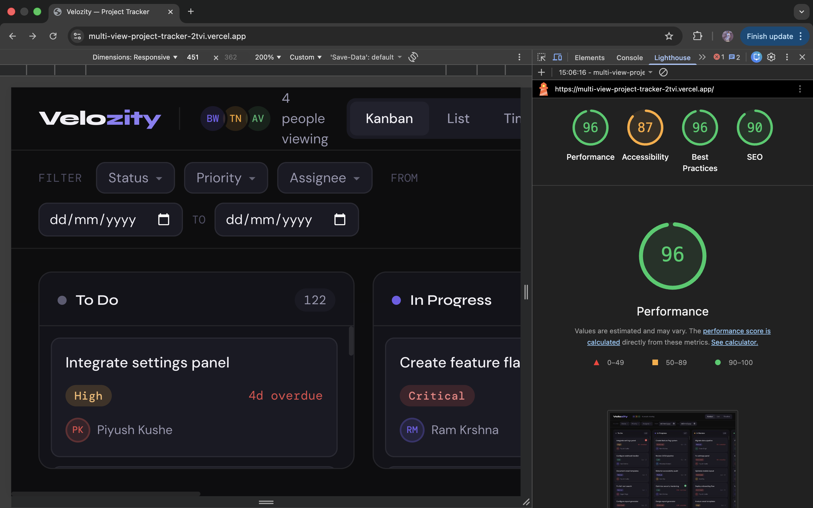

# 🚀 Multi-View Project Tracker

A high-performance project management UI built with **React + TypeScript, Zustand, and Tailwind CSS** — engineered from scratch with **no external drag-and-drop, virtual scrolling, or UI libraries**.

Supports **Kanban, List, and Timeline views** on a shared dataset with real-time collaboration indicators and optimized performance for 500+ tasks.

####🔗 Live demo: https://multi-view-project-tracker-2tvi.vercel.app/

---

## 🛠️ Setup Instructions

### Prerequisites
- Node.js 18+
- npm 9+

### Install & Run
```bash
git clone https://github.com/your-username/velozity-tracker
cd velozity-tracker
npm install
npm run dev

Open http://localhost:5173

### Build for production

```bash
npm run build
npm run preview
```


---

## 🧠 State Management: Why Zustand

All three views (Kanban, List, Timeline) share a single dataset and must update instantly without re-fetching.

**Zustand was chosen over Context + useReducer because:**

- ✅ Selector-based subscriptions → components re-render only when relevant state changes  
- ✅ Better performance → avoids full tree re-renders during drag or real-time updates  
- ✅ No Provider required → can be used inside custom hooks (e.g., drag-and-drop)  
- ✅ Simpler state updates → direct mutations via `set()`  

This ensures smooth interaction even with **500+ tasks and real-time collaboration updates**.

---

## ⚡ Virtual Scrolling (Custom Implementation)

**Problem:** Rendering 500 rows (~24,000px DOM) causes performance issues.

**Solution:**
- Render only visible rows + buffer (5 above & below)  
- Use a spacer div to maintain correct scroll height  
- Absolutely position rows (`top = index × height`)  

**Core Logic:**
```ts
startIndex = Math.floor(scrollTop / ROW_HEIGHT) - BUFFER
endIndex   = Math.ceil((scrollTop + viewportHeight) / ROW_HEIGHT) + BUFFER
   ```

## Drag-and-Drop Implementation

**API:** Pointer Events (`pointerdown`, `pointermove`, `pointerup`)  
A single unified handler supports both mouse and touch. `setPointerCapture` ensures events continue even when the pointer leaves the board.

### Placeholder without layout shift

Removing a dragged card normally causes column collapse and UI jump.

**Solution: Ghost Placeholder**
Measure card height
Insert ghost element before the card
Reduce original card opacity
Render floating clone following cursor

The column height remains unchanged, preventing layout shift and preserving visual stability.

### Drag Behavior

- **Live positioning:** Cursor position is compared with card midpoints to determine insertion point  
- **Snap-back:** Invalid drops restore the original position instantly  
- **Touch support:** Works seamlessly via Pointer Events with `touchAction: 'none'`  

---

## Hardest UI Problem

Keeping **Kanban column height stable during drag-and-drop** was the most challenging part.

Naively removing the dragged card causes the column to collapse, leading to visible UI jumps and loss of spatial context.

### Solution

The fix was to **insert a ghost placeholder before any DOM mutation**:

1.Insert ghost element (same height)
2.Reduce original card opacity
3.Attach floating clone to cursor

This ensures the column height never changes — resulting in **zero layout shift** and a smooth drag experience, even for cards with dynamic heights.

### Future Improvement

Optimize virtual scrolling using a **node recycling pool** instead of re-rendering 
---

## Lighthouse Perfomance

**Target: 85+ on Desktop**

Performance factors:
- Vite build: tree-shaking, code splitting, minification
- Virtual scrolling: only ~20 DOM nodes in list view regardless of dataset
- No render-blocking resources
- No external JS libraries (Zustand = 1.1kb gzipped)
- CSS transitions only (no JS animation loops)
- Tasks generated at runtime — zero network requests

Screenshot: 


